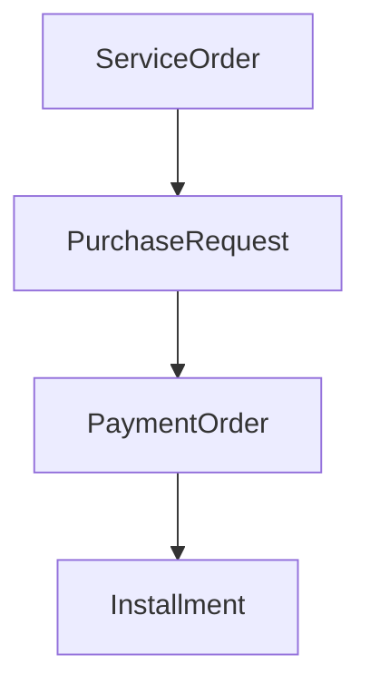

# Sistema de Solicitações de Compras

Este projeto é uma implementação simples e funcional de um sistema de solicitações de compras usando PHP, Laravel, Livewire, Blade, Tailwind e MySQL/SQLite para execução local.

## Tecnologias utilizadas

- PHP 8.3+
- Laravel 13
- Livewire 4
- Blade
- Tailwind CSS
- MySQL (ou SQLite para ambiente local)
- Eloquent ORM

## Requisitos

- PHP 8.3+
- Composer
- Node.js + npm
- MySQL (opcional para uso direto; o projeto também funciona com SQLite local)

## Instalação

No Windows, os comandos podem ser executados em PowerShell:

```powershell
composer install
Copy-Item .env.example .env -Force
php artisan key:generate
npm install
npm run build
```

### Configuração do .env

Para o ambiente local, o projeto já vem com SQLite configurado por padrão. Se preferir usar MySQL, ajuste o bloco abaixo:

```env
DB_CONNECTION=mysql
DB_HOST=127.0.0.1
DB_PORT=3306
DB_DATABASE=solicitacao_compras
DB_USERNAME=root
DB_PASSWORD=
```

## Banco de dados

Execute as migrations e seeders:

`powershell
php artisan migrate --seed
`

Ou para reiniciar o banco completamente:

```powershell
php artisan migrate:fresh --seed
```

## Executar o projeto

```powershell
php artisan serve
```

A aplicação ficará disponível em:

http://127.0.0.1:8000

## Estrutura do projeto

- app/Models: modelos Eloquent
- app/Http/Livewire: componentes Livewire
- resources/views/livewire: telas do sistema
- database/migrations: estrutura do banco
- database/seeders: dados de demonstração
- routes/web.php: rotas principais

## Relacionamentos do banco



### Explicação dos relacionamentos

- ServiceOrder pode ter várias PurchaseRequest. O campo service_order_id na solicitação pode ser null porque nem toda solicitação precisa estar vinculada a uma ordem de serviço.
- PurchaseRequest possui várias PaymentOrder porque uma solicitação pode ter mais de uma forma de pagamento.
- PaymentOrder possui várias Installment porque um pagamento parcelado precisa de várias parcelas.
- O sistema diferencia pagamento à vista e parcelado por meio do campo payment_type.

## Regras de negócio principais

- Uma solicitação pode ou não ter uma ordem de serviço.
- Uma solicitação pode ter uma ou mais ordens de pagamento.
- Pagamentos à vista não precisam de parcelas.
- Pagamentos parcelados exigem parcelas e o somatório delas deve bater com o valor total.
- Validações básicas de campos e datas foram implementadas.

## Principais decisões técnicas

- Foi priorizada uma arquitetura simples, com modelos, migrations, seeders e Livewire.
- O fluxo principal é fácil de explicar e demonstrar em entrevista.
- As regras de negócio foram mantidas em componentes Livewire e no modelo Eloquent.

## Funcionalidades implementadas

- Cadastro, listagem, edição, visualização e exclusão de solicitações
- Vinculação opcional com ordem de serviço
- Cadastro de ordens de pagamento à vista ou parceladas
- Cadastro e visualização de parcelas
- Validação básica de valores, datas e inconsistências
